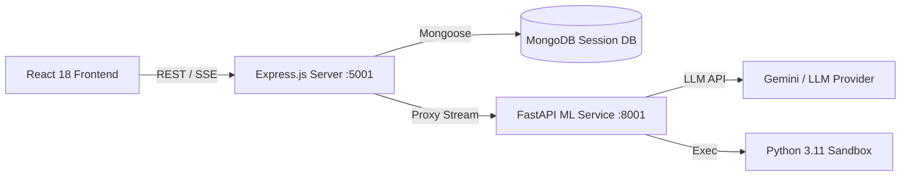

# 🕵️ STRATEGOS — Autonomous Data Analyst Agent

**STRATEGOS** is a full-stack, AI-powered autonomous data analyst. Upload any CSV, Excel, or JSON dataset, formulate data research questions, and the agent will independently reason, write Python code, execute it in a sandboxed environment, render visualizations, and generate structured executive reports.

Built with a **React 18** frontend, a **Node.js/Express** REST API with **MongoDB** persistence, and a **FastAPI** Python ML Service powering an autonomous ReAct (Reason + Act) loop.

---

## 🌟 Key Features

- **🧠 Autonomous ReAct Agent Loop:** Iterative Plan → Code → Execute → Self-Correct loop. The agent formulates hypotheses, writes Pandas/Matplotlib scripts, executes code in a Python sandbox, and self-corrects runtime errors.
- **⚡ Real-time Stream Output:** Server-Sent Events (SSE) stream the agent's internal reasoning, Python execution steps, and tool logs directly to the UI in real-time.
- **📊 Automatic Chart Visualizations:** The agent automatically generates Seaborn/Matplotlib charts, which are base64-encoded and rendered directly in the report gallery.
- **🔍 Dataset Schema Profiling:** Automatic inspection of column datatypes, missing value counts, numerical summary statistics, and sample row previews.
- **🔌 Multi-Model Reasoning Support:** Switch between **Gemini 1.5**, **Claude 3.5**, and **GPT-4o** from the query console.
- **📁 Persistent History & Session Storage:** Saved analysis reports, dataset metadata, and chart artifacts are stored in MongoDB.
- **📄 Markdown & Copy Exports:** One-click export of generated reports as markdown (`.md`) files or formatted clipboard text.

---

## 🏗️ Architecture



---

## 🛠️ Tech Stack

- **Frontend:** React 18, Vite, Tailwind CSS 3.4, Lucide Icons, Axios
- **API Server & Persistence:** Node.js, Express.js, MongoDB, Mongoose ORM, Multer
- **ML & Agent Engine:** Python 3.11, FastAPI, Uvicorn, Pandas, NumPy, Matplotlib, SciPy, Google GenAI SDK
- **Containerization:** Docker, Docker Compose

---

## 🚀 Quick Start (Docker)

The easiest way to run STRATEGOS is via Docker Compose.

1. **Clone the repository:**
   ```bash
   git clone https://github.com/raiyashu2004/STRATEGOS.git
   cd STRATEGOS
   ```

2. **Configure Environment Variables:**
   Create a `.env` file inside `backend/` directory:
   ```env
   GEMINI_API_KEY=your_gemini_api_key_here
   ```

3. **Launch Containers:**
   ```bash
   docker compose up --build -d
   ```

4. **Access the App:**
   - **Frontend UI:** `http://localhost:3000`
   - **Express Server API:** `http://localhost:5001`
   - **FastAPI Engine:** `http://localhost:8001`

---

## 📝 Usage

1. **Upload Dataset:** Select a `.csv`, `.xlsx`, or `.json` file, or load a pre-configured sample dataset (`Sales Performance`, `Student Performance`).
2. **Inspect Schema:** Review column datatypes, missing value counts, and statistical sample distributions in the Data Explorer tab.
3. **Formulate Query:** Ask a specific question (e.g., *"What is driving the Q3 revenue variance across regions?"*) or choose a recommended query.
4. **Observe ReAct Loop:** Watch the execution stream to inspect live Python code blocks, execution latencies, and output metrics.
5. **Review Report:** Analyze the Executive Summary, Key Findings, Strategic Recommendations, and Visualizations.
6. **Follow-up Chat:** Ask clarifying questions about the generated report in the interactive follow-up chat.
